# CICD環境
## CI
Github Actionsでテストを実行する。実行タイミングは「developブランチへのプルリクエスト作成時」、「mainブランチへのプルリクエスト作成時」。

テスト失敗時はマージを行わない。

main、developブランチへの直接プッシュを禁止する。

## ~~CD案１~~
mainブランチにマージしたときにデプロイを行う。Github Actionsからでコンテナイメージをビルド後、ECRにプッシュする。
新しいECSを作成しデプロイする。

参考:
[Github Doc](https://docs.github.com/ja/actions/deployment/deploying-to-your-cloud-provider/deploying-to-amazon-elastic-container-service)
[クラスメソッド](https://dev.classmethod.jp/articles/githubactions-ecs-fargate-cicd-beginner/)

## CD案2
mainブランチにマージしたときにデプロイを行う。mainブランチの変更を検知してCodePipelineがトリガーされる。CodeBuildでビルドされたコンテナイメージがECRにプッシュされ、ECSに新しいサービスがデプロイされる。

### Code Pipeline
1. 新しいパイプラインを作成する。
   1. パイプライン名「NautyGhost_Deploy」。
   2. サービスロールを新規作成する。
2. ソースステージを追加する。
   1. ソースプロバイダーは「Github(バージョン2)」を選択する。
   2. 接続は新しくOAuth認可を作成する。
      1. [設定の接続](https://ap-northeast-1.console.aws.amazon.com/codesuite/home?region=ap-northeast-1)に追加される。
   3. リポジトリ名を選択する。
   4. ブランチ名を選択する。
   5. 検出オプションは「ソースコードの変更時にパイプラインを開始する」にチェックを入れる。
3. ビルドステージを追加する。
   1. プロバイダーは「AWS Codebuild」を選択する。
   2. リージョンは「ap-northeast-1」を選択する。